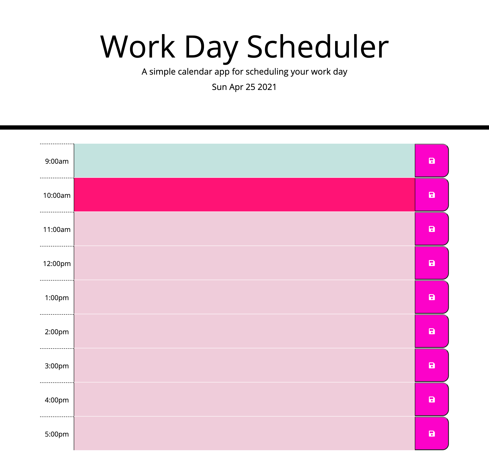

# Work Day Scheduler

An application that will display color coded time-blocks representing the hours in a work day and allow users to edit each block to schedule events. 

## Usage
* When the application loads it will display the current day at the top and the time blocks will be color coded to show if the hour has passed, if it is the current hour or if the hours are in the future.
* The time blocks' text field can be selected to add events and clicking the save button will store the event so it persists even if the page is reloaded. 

## Link to Deployed Application:
https://crossigarcia.github.io/day-planner

## Screenshot of Application

